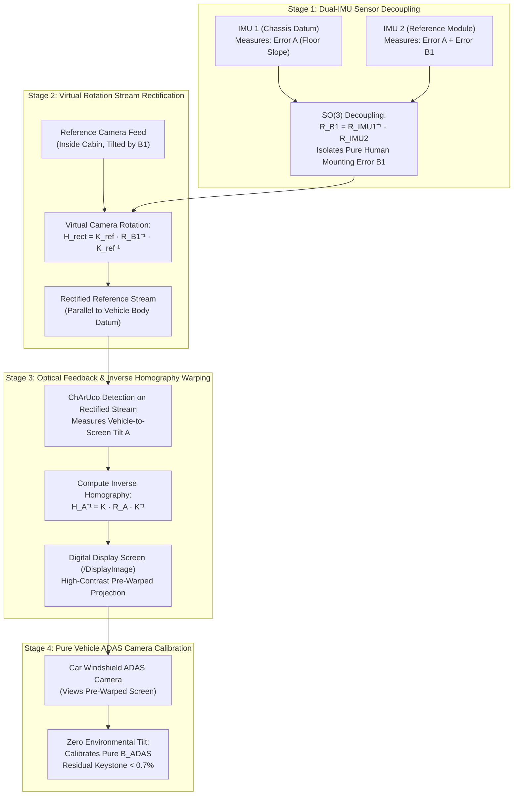
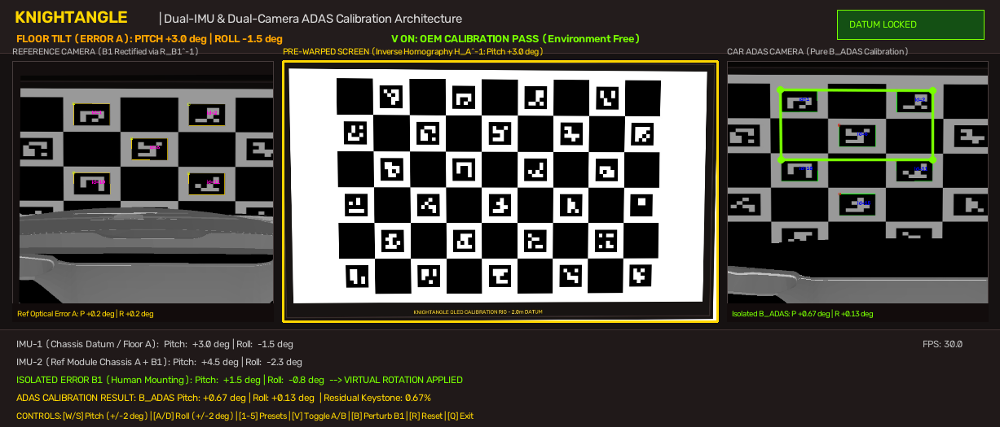
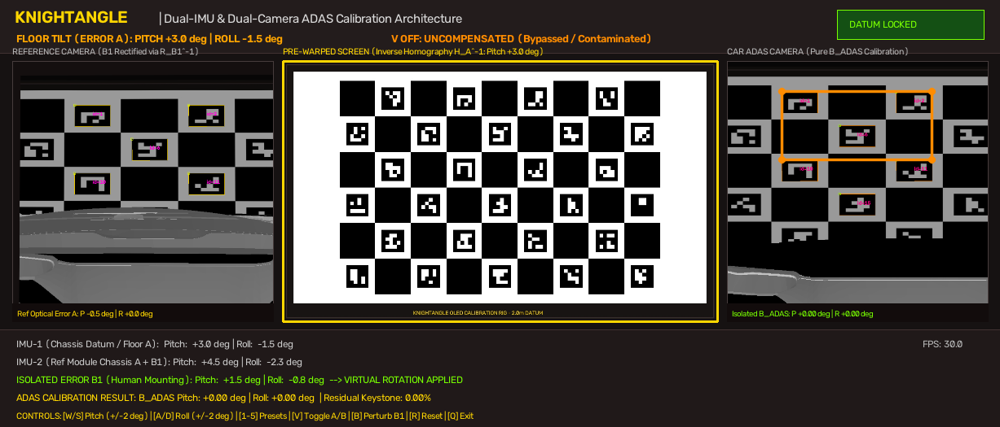

# KnightAngle: Software-Defined ADAS Dynamic Calibration Platform

[](https://www.python.org/downloads/)
[](https://www.coppeliarobotics.com/)
[](https://opencv.org/)
[]()
[]()

> **Eliminating the Need for Physical Leveling Bays in Automotive ADAS Calibration**  
> Dynamic optical compensation of floor tilt and technician placement errors through closed-loop inverse homography projection and dual-sensor SO(3) decoupling.

---

## 1. Executive Summary & Problem Statement

OEM forward-facing ADAS cameras (AEB, Lane Keep Assist, Adaptive Cruise Control) require optical calibration targets positioned within strict angular bounds ($< 0.1^\circ$ alignment tolerance). 

In real-world repair garages and service centers:
1. **Environmental Floor Incline (Error A)**: Floors have uneven slopes, drainage gradients ($1^\circ - 3^\circ$), or suspension load asymmetry.
2. **Technician Manual Mounting Imperfections (Error B1)**: Hand-placed calibration tools and reference modules deviate from vehicle datum.
3. **The Danger of Uncompensated Calibration**: Bypassing environmental error bakes garage floor tilt directly into vehicle safety computers, resulting in dangerous phantom braking or high-speed lane departure.

**KnightAngle's Software-Defined Solution**:
By pairing vehicle datum measurements with an in-cabin Reference Module and streaming dynamically pre-warped calibration patterns onto digital display screens, environmental floor slope is optically cancelled out. The vehicle's ADAS camera perceives a geometrically square, level target, enabling pure factory calibration under arbitrary workshop conditions.

---

## 2. System Architecture & 4-Stage Workflow



---

## 3. Mathematical Formulation

### 3.1 Dual-IMU Decoupling in $\text{SO}(3)$
Let $R_{\text{IMU}_1} \in \text{SO}(3)$ represent the vehicle chassis gravity datum (measuring floor slope $A$), and $R_{\text{IMU}_2} \in \text{SO}(3)$ represent the Reference Module orientation (measuring $A \oplus B_1$). The technician mounting error $R_{B_1}$ is isolated via:

$$R_{B_1} = R_{\text{IMU}_1}^T \cdot R_{\text{IMU}_2}$$

### 3.2 Virtual Camera Rotation
To correct for technician physical misplacement without manual hardware repositioning, the Reference Camera's intrinsic matrix $K_{\text{ref}}$ is used to apply a virtual inverse rotation:

$$H_{\text{virtual}} = K_{\text{ref}} \cdot R_{B_1}^T \cdot K_{\text{ref}}^{-1}$$

$$I_{\text{rectified}}(x, y) = I_{\text{raw}}(H_{\text{virtual}}^{-1} \cdot [x, y, 1]^T)$$

The rectified video feed is mathematically indistinguishable from an ideally placed sensor parallel to the vehicle chassis datum.

### 3.3 Dynamic Inverse Homography with Centroid Invariance
Using measured vehicle-to-screen tilt $A = [\theta_{\text{pitch}}, \phi_{\text{roll}}]$, the inverse homography $H_A^{-1}$ compensates for projective keystoning:

$$H_{\text{planar}} = K \cdot R(\theta, \phi) \cdot K^{-1}$$

To ensure the projected pattern remains centered on the physical digital display during dynamic tilt sweeps, an optical centering constraint $T_{\text{center}}$ is enforced:

$$T_{\text{center}} = \begin{bmatrix} 1 & 0 & \frac{W}{2} - x_c' \\ 0 & 1 & \frac{H}{2} - y_c' \\ 0 & 0 & 1 \end{bmatrix}, \quad [x_c', y_c', 1]^T = H_{\text{planar}} \cdot \left[\frac{W}{2}, \frac{H}{2}, 1\right]^T$$

$$H_A^{-1} = T_{\text{center}} \cdot H_{\text{planar}}$$

### 3.4 Pure ADAS Camera Calibration Isolation
Because the display screen pre-cancels $A$, the incoming light rays arriving at the vehicle windshield camera have zero keystoning from the floor. Any residual angular skew measured by the ADAS camera is purely its factory physical alignment error:

$$\text{Residual Measured} = B_{\text{ADAS}}$$

---

## 4. Verification & Validation (A/B Test Results)

### V ON: Compensated State (OEM Calibration Pass)
Under an induced floor incline of $+3.0^\circ$ Pitch and $-1.5^\circ$ Roll with a $+1.5^\circ / -0.8^\circ$ technician mounting error, KnightAngle applies real-time stream rectification and screen pre-warping:



- **Panel 1 (Left - Reference Module)**: Virtual rotation $R_{B_1}^{-1}$ applied; 5 ChArUco markers locked.
- **Panel 2 (Center - Digital TV Screen)**: Dynamic inverse homography $H_A^{-1}$ pre-warping active.
- **Panel 3 (Right - Car ADAS Camera)**: Perfectly parallel datum lines; pure $B_{\text{ADAS}}$ isolated ($+0.67^\circ$ pitch, $+0.13^\circ$ roll, $<0.7\%$ residual keystone).
- **Status**: `V ON: OEM CALIBRATION PASS (Environment Free)`.

### V OFF: Uncompensated State (Contaminated by Floor Slope)
When compensation is bypassed ($V$ OFF), the screen displays a static flat pattern:



- Floor incline causes projective keystone distortion across the vehicle camera view.
- Attempting calibration in this state bakes the floor incline into the ADAS computer.
- **Status**: `V OFF: UNCOMPENSATED (Bypassed / Contaminated)`.

---

## 5. Repository Structure

```
knightangle/
├── main.py                     # Main interactive 3-panel simulation & calibration runner
├── calibration_engine.py       # Core math engine: SO(3) fusion, virtual rotation, inverse homography
├── verify_calibration.py       # Automated multi-axis V&V sweep script
├── phone_bridge.py             # Mobile smartphone digital twin server (HTML5 DeviceOrientation)
├── glare_reduction.py          # Environmental reflection & tube-light suppression filter
├── warping.py                  # Standalone projective homography utilities
├── requirements.txt            # Python environment dependencies
├── Final_Environment.ttt       # CoppeliaSim scene: Tata Safari + 2.80m x 1.68m DisplayImage (Updated bay)
├── Environment.ttt             # Baseline scene
├── TATAinnoVent.ttt            # Secondary compact testbed scene
├── ChArUco.jpg                 # Synthesized 9x6 high-contrast calibration pattern
├── docs/assets/                # Packaged verification screenshots & presentation figures
└── artifacts_archive/          # Archive of empirical sweep captures and diagnostics
```

---

## 6. Getting Started & Execution

### 6.1 Prerequisites
```bash
pip install -r requirements.txt
```

Ensure CoppeliaSim Edu is installed and running with `Final_Environment.ttt`:
```bash
coppeliaSim.sh /home/mohammed/knightangle/Final_Environment.ttt
```

### 6.2 Running the Interactive Testbed
```bash
python3 main.py
```

### 6.3 Interactive Keyboard Controls
| Key | Function |
| :---: | :--- |
| `W` / `S` | Increase / Decrease vehicle floor pitch ($\pm 2.0^\circ$) |
| `A` / `D` | Increase / Decrease vehicle floor roll ($\pm 2.0^\circ$) |
| `1` | Flat bay preset ($0.0^\circ$) |
| `2` | Moderate incline preset ($+5.0^\circ$ Pitch) |
| `3` | Steep ramp incline preset ($+10.0^\circ$ Pitch) |
| `4` | Downhill slope preset ($-5.0^\circ$ Pitch) |
| `5` | Lateral uneven floor preset ($+5.0^\circ$ Roll) |
| `V` | **Toggle KnightAngle Compensation ON / OFF (Instant A/B Test)** |
| `B` | Perturb technician mounting error $B_1$ ($\pm 1.5^\circ$) |
| `R` | Reset vehicle orientation to level ground |
| `Q` | Graceful exit & shutdown |

### 6.4 Automated Verification Suite
Run empirical multi-point sweep across $-10^\circ$ to $+10^\circ$ incline:
```bash
python3 verify_calibration.py
```

### 6.5 Smartphone Physical Digital Twin
Open `http://<your-ip>:8080` in your smartphone browser to tilt your physical device and observe the digital twin vehicle tilt in real time!
